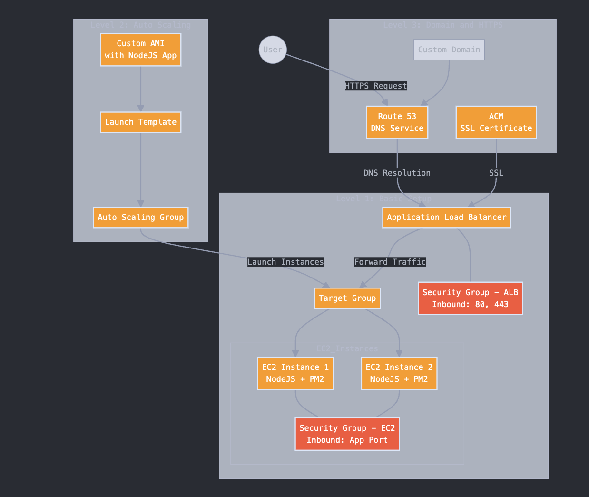

# ALB-NodeJS Project

This is a simple Node.js project used to demonstrate load balancing. It returns the public and private IP addresses of the server hosting the application.

---

## **Assignment Overview**

### **Level 1: Basic Setup**
1. Launch **two EC2 instances** of type `t2.micro`.
2. Install required packages:
   - Install **Node.js** using `nvm`.
   - Install **PM2** to run the Node.js application in the background.
3. Create a **Target Group** and register the EC2 instances with it.
4. Set up a **Load Balancer** and attach it to the Target Group.
5. Configure a **Security Group**:
   - Allow inbound traffic on the application's port.

---

### **Level 2: Auto Scaling**
1. Create an **AMI** (Amazon Machine Image) from one of the EC2 instances running the application.
2. Create a **Launch Template** using the AMI created in the previous step.
3. Configure an **Auto Scaling Group**:
   - Use the Launch Template.
   - Attach it to the Target Group created in Level 1.
4. Test Auto Scaling:
   - Delete the original EC2 instances.
   - Verify that the Auto Scaling Group automatically launches new instances.

---

### **Level 3: Domain and HTTPS**
1. Route traffic to the Load Balancer using **Route 53**.
2. Generate an **SSL certificate** using AWS ACM (AWS Certificate Manager).
3. Configure the Load Balancer to:
   - Redirect traffic from HTTP to HTTPS.
   - Serve the application securely using the SSL certificate.

---

## **Expected Outcomes**

### **Level 1: Basic Setup**
- The application is accessible via the public DNS of the Load Balancer.
- Load balancing is functioning correctly.

### **Level 2: Auto Scaling**
- Successfully created an Auto Scaling Group with the Launch Template and Target Group.
- Auto Scaling works as expected:
  - Automatically scales in and out based on the load.
  - Load Balancer maintains proper functionality with scaled instances.

### **Level 3: Domain and HTTPS**
- Traffic is routed securely using an SSL certificate and a custom domain.
- The application is accessible over HTTPS, and all functionalities work as expected.

### Architecture Diagram

